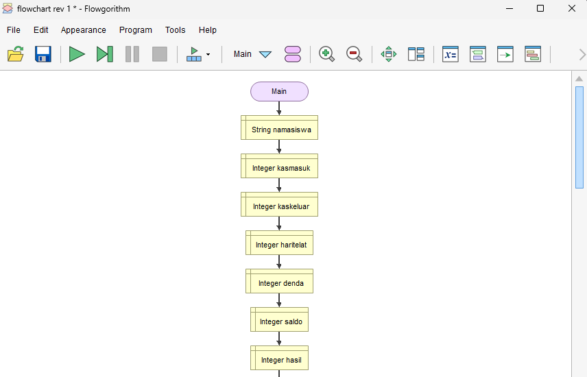

<!-- 🔴 NAVBAR -->
<div class="navbar">
  <div class="logo">CRAZYTEAM</div>
  <div class="badges">
    
    
  </div>
</div>

<!-- 🎬 HERO -->
<div class="hero">


<div class="hero-text">

<h1>Program Kas Kelas</h1>

<h2>Aplikasi Keuangan Tanpa Batas.</h2>

<p>
Kelola pemasukan dan pengeluaran kas kelas dengan sistem yang lebih profesional dan terstruktur.
</p>

<input class="email-box" placeholder="Masukan Nama"/>
<a href= "https://github.com/Dhilaja/Tugas-Proyek-Crayzteam.git" class="netflix-btn">Mulai &gt;</a>

</div>
</div>

<hr class="divider">

<!-- 🔥 TRENDING -->
<div class="Flowchart">

<h2 style="font-weight:700; margin-bottom:20px;">🔥 Proyek 1</h2>




</div>

<hr class="divider">

# 🎬 Tentang Project

Program Kas Kelas adalah aplikasi berbasis **Python CLI** yang dikembangkan untuk membantu pencatatan pemasukan dan pengeluaran kas kelas secara sistematis dan efisien.

### Fitur CLI Program Python Kas Kelas
- Tahap 1 — Tambah Siswa  
- Tahap 2 — Catat Pembayaran
- Tahap 3 — Denda Telat Bayar   
- Tahap 4 — Catat Pengeluaran
- Tahap 5 — Lihat Siswa Belum Bayar 
- Tahap 6 — Laporan Total Kas dan Saldo Akhir

---

# Cara Menjalankan Program Python

```bash
git clone https://github.com/Dhilaja/Tugas-Proyek-Crayzteam.git
cd Tugas-Proyek-Crayzteam
python main.py